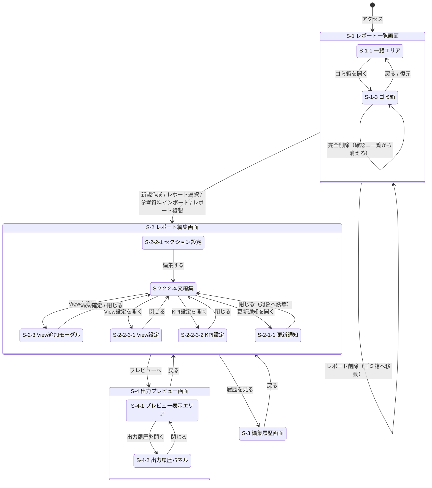

# Reporting Ph.1 画面要件定義

> PRD参照: [【Reporting】Ph.1機能要件_Reporting機能](https://www.notion.so/3052ceae322580a4b64cc660aa06e9cf)
> 最終更新: 2026-04-01 | ステータス: 開発中 | リリース予定: 2026-04-30

---

## 1. 画面一覧

| 画面ID | 画面名 | 目的 | 対象ユーザー |
|--------|--------|------|-------------|
| S-1 | レポート一覧画面 | 既存レポートの選択・新規作成の起点 | サステナ担当 |
| S-1-1 | 一覧エリア | レポートカード一覧の表示と選択 | サステナ担当 |
| S-1-3 | ゴミ箱 | 論理削除済みレポートの復元・完全削除 | サステナ担当 |
| S-2 | レポート編集画面 | セクション・本文・View・設定を統合編集してドラフトを完成させる | サステナ担当 |
| S-2-1 | ヘッダーバー | 保存・プレビュー遷移・履歴遷移などの共通操作 | サステナ担当 |
| S-2-1-1 | 更新通知（差分あり） | KPI・目標値の更新を通知し、再確認・再出力を促す | サステナ担当 |
| S-2-2 | メイン編集領域 | セクション・本文・Viewを一体として編集 | サステナ担当 |
| S-2-2-1 | セクション設定 | セクション追加・並び替え・階層編集 | サステナ担当 |
| S-2-2-2 | 本文編集 | セクション内テキスト・View挿入位置の編集 | サステナ担当 |
| S-2-2-3 | 表示設定 | View/KPIの表示設定を確定するサイドパネル | サステナ担当 |
| S-2-2-3-1 | View設定 | View単位の表示形式・期間・目標表示設定 | サステナ担当 |
| S-2-2-3-2 | KPI設定 | KPI単位の数値書式・目標値表示設定 | サステナ担当 |
| S-2-3 | View追加モーダル | ViewとKPI紐づけの設定 | サステナ担当 |
| S-3 | 編集履歴画面 | レポートの編集履歴一覧・差分確認 | サステナ担当 |
| S-4 | 出力プレビュー画面 | 出力前確認と出力操作・出力履歴確認 | サステナ担当 |
| S-4-1 | プレビュー表示エリア | レポート内容のプレビュー表示 | サステナ担当 |
| S-4-2 | 出力履歴パネル | 過去出力物の履歴一覧・再ダウンロード | サステナ担当 |

---

## 2. 画面遷移

### 遷移サマリー

| 元画面 | 操作 | 遷移先 |
|--------|------|--------|
| S-1-1 | 新規作成ボタン | S-2 |
| S-1-1 | レポートカード押下 | S-2 |
| S-1-1 | 参考資料インポート（PDF アップロード） | S-2 |
| S-1-1 | レポート複製（カードメニュー） | S-2 |
| S-1-1 | ゴミ箱を開く | S-1-3 |
| S-1-1 | レポート削除（カードメニュー） | S-1-1（ゴミ箱へ移動後） |
| S-1-3 | 復元 | S-1-1 |
| S-1-3 | 戻る | S-1-1 |
| S-2 | プレビューボタン | S-4 |
| S-2 | 編集履歴ボタン | S-3 |
| S-4 | 戻るボタン | S-2 |
| S-3 | 戻るボタン | S-2 |

---

## 3. 各画面の状態

### S-1-1 一覧エリア

| 状態 | 条件 | 表示内容 |
|------|------|---------|
| 通常 | レポートが1件以上 | レポートカード一覧 |
| 空状態 | レポートが0件 | 「レポートがありません。新規作成してください。」+ 新規作成ボタン |
| ローディング | 一覧取得中 | スケルトンローダー |
| エラー | API取得失敗 | エラーメッセージ + 再試行ボタン |
| 更新通知あり | KPI/目標値に差分あり | カードに「更新あり」チップ表示 |

### S-1-3 ゴミ箱

| 状態 | 条件 | 表示内容 |
|------|------|---------|
| 通常 | 削除済みレポートが1件以上 | 削除済みレポート一覧 + 完全削除予定日 |
| 空状態 | 削除済みレポートが0件 | 「ゴミ箱は空です。」 |
| 削除確認ダイアログ | 完全削除ボタン押下 | 「完全削除すると編集・出力履歴も削除されます」+ 完全削除実行 / キャンセル |

### S-2 レポート編集画面

| 状態 | 条件 | 表示内容 |
|------|------|---------|
| 通常 | 編集中 | ヘッダーバー + セクション設定 + 本文編集 + 表示設定 |
| 自動保存中 | 編集内容が保存中 | ヘッダーに「下書きを保存中…」 |
| 自動保存完了 | 保存完了 | ヘッダーに「下書きを保存済み」 |
| 差分あり | KPI/目標値に更新あり | ヘッダーに更新件数バッジ + 該当ViewにハイライトとリロードアイコンKPIに更新あり |
| ローディング | レポートデータ取得中 | スケルトンローダー |

### S-2-1-1 更新通知

| 状態 | 条件 | 表示内容 |
|------|------|---------|
| 通常（差分あり） | KPI値または目標値に更新あり | 差分ありViewのハイライト + リロードアイコン |
| 更新確認ダイアログ | 更新実行ボタン押下 | 「以下の値が上書きされます」+ 変更前後の値一覧 + 更新実行 / キャンセル |
| 更新完了 | 更新実行後 | ハイライト解除 |

### S-2-3 View追加モーダル

| 状態 | 条件 | 表示内容 |
|------|------|---------|
| 初期 | モーダル開いた直後 | View名入力 + KPI検索 |
| KPI検索中 | キーワード入力後 | KPI候補リスト |
| KPI選択済み | KPIを選択した状態 | 選択済みKPIチップ + 確定 / 取消ボタン |
| 確定処理中 | 確定ボタン押下後 | ローディングスピナー |

### S-3 編集履歴画面

| 状態 | 条件 | 表示内容 |
|------|------|---------|
| 通常 | 履歴が1件以上 | 履歴行一覧（降順） |
| 空状態 | 履歴が0件 | 「編集履歴はありません」 |
| 完全削除済み履歴 | operation=PURGE | 半透明表示、アクションリンク非表示 |
| 差分ダイアログ | 「変更内容を確認する」押下 | 横並び比較（変更前 / 変更後）、テキスト部分差分ハイライト、テーブルセル単位ハイライト |

### S-4-2 出力履歴パネル

| 状態 | 条件 | 表示内容 |
|------|------|---------|
| 通常 | 出力履歴が1件以上 | 出力履歴行一覧（降順） |
| 空状態 | 出力履歴が0件 | 「出力履歴はありません。」 |
| 閉じた状態 | パネルが折りたたまれている | ヘッダーに「出力履歴」ボタンのみ |
| 再生成中 | 「再ダウンロード」押下後 | ローディングスピナー |

---

## 4. フォーム構造

### 4-1. レポート削除確認ダイアログ（S-1-1）

| 項目 | 内容 |
|------|------|
| 表示タイミング | カードメニュー「削除」押下時 |
| 表示内容 | 「30日後に自動で完全削除されます」「完全削除時は編集・出力履歴も削除されます」 |
| アクション | 削除実行（ゴミ箱へ移動） / キャンセル |
| 送信後の挙動 | 一覧から対象カードが消える、ゴミ箱に追加される |

### 4-2. 参考資料インポート（S-1）

| 項目 | 内容 |
|------|------|
| 入力方法 | ドラッグ＆ドロップ または ファイル選択ダイアログ |
| 受付ファイル形式 | PDF |
| ファイル容量上限 | 100MB |
| バリデーション | PDF以外 → エラー表示、100MB超過 → エラー表示 |
| 送信後の挙動 | レポート編集画面（S-2）へ遷移、インポート元ファイルがレポートに紐づく |

### 4-3. バージョン保存（版の保存）（S-2-1）

| 項目 | 内容 |
|------|------|
| 操作 | ヘッダーバーの「版を保存」ボタン押下 |
| バリデーション | なし（明示的な操作のみ） |
| 送信後の挙動 | 履歴に新バージョンとして記録、差分検知ベースラインを更新 |
| 自動保存との区別 | 「下書きを保存済み」= 自動保存、「版を保存」= バージョン保存 |

### 4-4. View追加モーダル（S-2-3）

| 項目 | 型 | 必須 | バリデーション |
|------|----|------|--------------|
| View名 | テキスト入力 | 任意 | — |
| KPI検索キーワード | テキスト入力（検索） | 最低1件選択必須 | 0件選択でエラー |
| KPIグループ（大・中・小分類） | 階層セレクト | 任意 | — |
| 追加KPI（複数選択） | チェックボックス | 最低1件必須 | — |
| フリーフォーマット列 | テキスト入力 | 任意 | — |
| フリーフォーマットセル | テキスト / 数値入力 | 任意 | — |
| 四則演算定義 | 式入力 | 任意 | 構文エラー時に表示 |

**送信後の挙動:**
- View確定 → モーダルを閉じて本文編集にViewが挿入される
- KPI確定時に Consolidation から目標の一覧・目標値を取得してReporting側に保持
- 取消 → モーダルを閉じてViewは追加されない

### 4-5. View設定（S-2-2-3-1）

| 項目 | 型 | 説明 |
|------|----|------|
| 表示形式 | ラジオボタン（表のみ） | 現時点は「表」のみ選択可 |
| 比較表示 | トグル | 前年差分等の比較表示の有無 |
| 目標を表示 | トグル | 目標設定エリア全体の表示ON/OFF |
| 年度セレクトボックス | セレクト | 対象年度を選択 |
| 目標チェックリスト | チェックボックス（複数選択） | 選択年度に紐づく目標を選択（1指標:N目標） |
| ＋目標年度を追加 | ボタン | 別の年度ブロックを追加 |
| 表示切替（年度別/事業所別） | ラジオボタン | 軸の切り替え |
| 表示期間 | セレクト（年度別） | 表示する年度範囲を選択 |
| 表示事業所 | チェックボックス（複数選択） | 事業所別の場合のみ表示（全事業所を含む） |
| 書式設定 | 以下の書式設定参照 | View全体に適用 |

### 4-6. KPI設定（S-2-2-3-2）

| 項目 | 型 | 説明 |
|------|----|------|
| 数値スケール | ラジオボタン | なし / 百・千・万・百万・億（漢数字） / k・M・G・T（SI） |
| カンマ区切り | トグル | あり / なし |
| 小数点以下の桁数 | ラジオボタン | 0〜5桁 |
| 丸め処理 | ラジオボタン | 四捨五入 / 切り捨て / 切り上げ |
| マイナス表記 | ラジオボタン | `-123` / `(123)` / `▲123` |
| 前年比（数値）を追加 | トグル | 前年差分列を追加 |
| 前年比（%）を追加 | トグル | 前年差率列を追加 |
| 目標値表示 | 表示のみ（View設定の目標表示設定に準拠） | 編集不可 |
| 個別KPI設定の解除 | ボタン | View全体の書式設定に戻す |

### 4-7. 完全削除確認ダイアログ（S-1-3）

| 項目 | 内容 |
|------|------|
| 表示タイミング | ゴミ箱の「完全削除」ボタン押下時 |
| 表示内容 | 「編集・出力履歴も含めてすべて削除されます。この操作は取り消せません。」 |
| アクション | 完全削除実行 / キャンセル |
| 送信後の挙動 | ゴミ箱から対象レポートが即時消える（物理削除）、編集・出力履歴も削除 |

### 4-8. 出力操作（S-4）

| 項目 | 内容 |
|------|------|
| 出力形式 | Word / Excel / PDF（選択） |
| 操作 | 出力メニューから形式を選択して実行 |
| 送信後の挙動 | スナップショットから都度再生成してダウンロード、`historyType=EXPORT` の履歴を追記 |
| ファイル名 | `{reportTitle}_{snapshotId}.{ext}` |
| 注意 | 出力ファイルはストレージに保存しない、都度再生成 |

---

## 5. その他UI要件・制約

### Undo/Redo（S-2-2-2）

- テキスト編集に対して Undo/Redo を提供
  - Mac: `⌘+Z` / `⌘+Shift+Z`
  - Windows: `Ctrl+Z` / `Ctrl+Y`（または `Ctrl+Shift+Z`）
- Undo/Redo が実現可能な場合: 確認ダイアログ不要
- Undo/Redo が実現不可の場合: 「この操作は復元できません」を確認ダイアログに明示

### View表（テーブル）の削除制御

- 「フリーテキスト行・列」と「KPI紐づけ行・列」が混在する場合、意図しない上書き・削除を防ぐ
- 行列削除はユーザーに明示的な削除動作を強制（ステップを踏ませる）
- フリーテキストを含む状態を視認できる場面でのみ削除可能（モーダル上では削除させない）

### 差分検知・更新ルール

- 差分検知・更新操作は **View（テーブル）単位** で独立
- 同一レポート内でもテーブルごとに個別更新が可能
- ConsolidationからReportingへの値の強制上書きはしない
- 目標項目（Target）の **新規追加** は通知対象外（表示設定の目標一覧に表示される）
- 目標値の **変更** はKPI値と同様に更新通知の対象

### 自動完全削除

- ゴミ箱内のレポートは削除から **30日後** に自動で完全削除
- 完全削除時は編集・出力履歴も含めてすべて削除

### 出力履歴・編集履歴の保持

- 出力履歴（`historyType=EXPORT`）はプレビュー画面右側パネル（S-4-2）でのみ確認
- 編集履歴（`historyType=EDIT`）は編集画面経由のサイドパネル（S-3）でのみ確認
- 出力ファイル自体はストレージに保持しない、スナップショットから都度再生成

---

## 付録: 書式設定オプション一覧

| カテゴリ | 選択肢 |
|----------|--------|
| 数値スケール（Basic） | なし |
| 数値スケール（漢数字） | 百（×100）/ 千（×1,000）/ 万（×10,000）/ 百万（×1,000,000）/ 億（×100,000,000） |
| 数値スケール（SI） | k（×1,000）/ M（×1,000,000）/ G（×1,000,000,000）/ T（×1,000,000,000,000） |
| カンマ区切り | あり / なし |
| 小数点以下桁数 | 0桁 / 1桁 / 2桁 / 3桁 / 4桁 / 5桁 |
| 丸め処理 | 四捨五入 / 切り捨て / 切り上げ |
| マイナス表記 | -123 / (123) / ▲123 |
